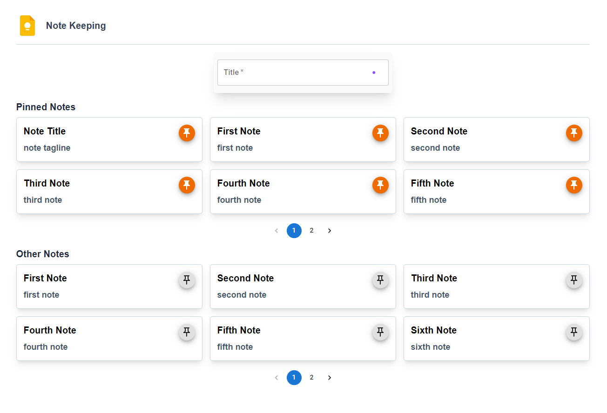

# Note-Keeping

<h2>This is an Image of Project</h2>

 

<h2>Technologies Used</h2>
<li>HTML</li>
<li>CSS</li>
<li>JavaScript</li>
<li>React</li>
<li>Material UI</li>
<li>TailwindCSS</li>
<li>Appwrite</li>
 

<h2>Features of this projects are given below:</h2>
<li><b>Shows List of Pinned and Unpinned Notes.</b></li>
<li><b>Allows to Create New Note.</b></li>
<li><b>Allows to Update Note Data.</b></li>
<li><b>Allows to Delete Note.</b></li>
<li><b>Allows Pagination to get Notes on each Page.</b></li>
<li><b>Fully Responsive.</b></li>
 

<h2>If you want to run this application in your system, Follow the below steps:</h2>
<h3>
<ol type="1">
   
  <li>
    Open a folder in a VS Code and go to the Terminal.
  </li>
   
  <li>
    Run the below command to clone repository
     "git clone https://github.com/moheebk123/Note-Keeping.git"
  </li>
   
  <li>
    Run the below command to change directory
     "cd .\Note-Keeping\"
  </li>
   
  <li>
    Run the below command to install necessary packages  "npm i" or
    "npm install"
  </li>
   
  <li>
    Run the below command to start development server "npm run dev"
  </li>
   
  <li>
    Go to the link provided by vite in terminal.
  </li>
</ol>
